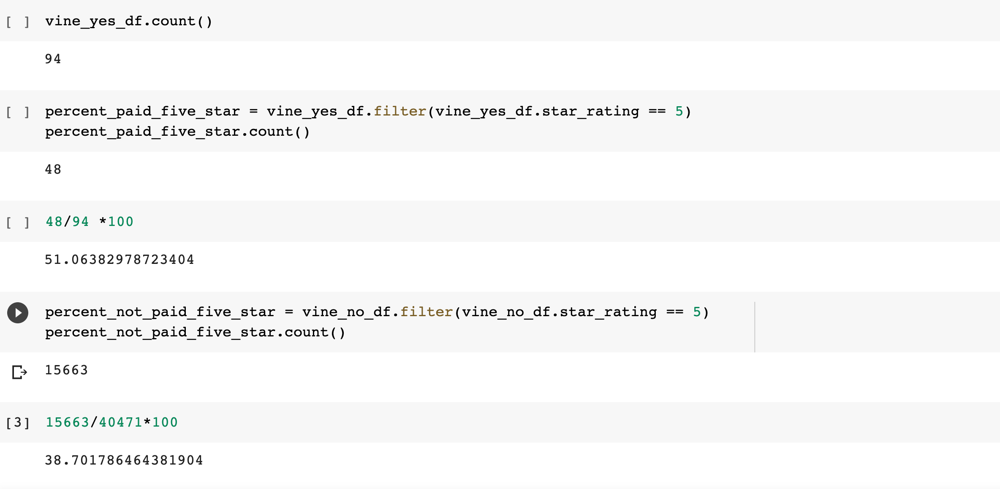

## Amazon Vine Analysis

#### Overview
- The purpose of this analysis was to discover if there is a bias in Amazon Vine customer behavior. After the analysis, we should have insight if customers have a bias rating in correlation with having paid for Vine. The process for this analysis will include the following:

- Perform ETL on Amazon Product Reviews
- Determine Bias of Vine Reviews
- A Written Report on the Analysis (README.md)

#### Results/Summary

The first step was to extract the data from S3. After, creating the tables in SQL we load this data into SQL. An example of the data loaded into PostgreSQL is shown below.

After recreating the vine table and transforming the dateframes, the results indicated there is a bias towards 5 star ratings for those who did pay. 

Vine Paid Count : **94**
Vine Paid with 5 Star review Count: **48**

**51%** of paying vine members left a 5 star rating

Vine  NOT Paid Count : **40471**
Vine NOT Paid with 5 Star review Count: **15663**

**38.7%** of NON-paying customers left a 5 star review. 

Per the data, we can conclude paying Vine customers leave a higher rating. However, the count of paying customers was much lower. Therefore, the data may be subject to bias. 

  

